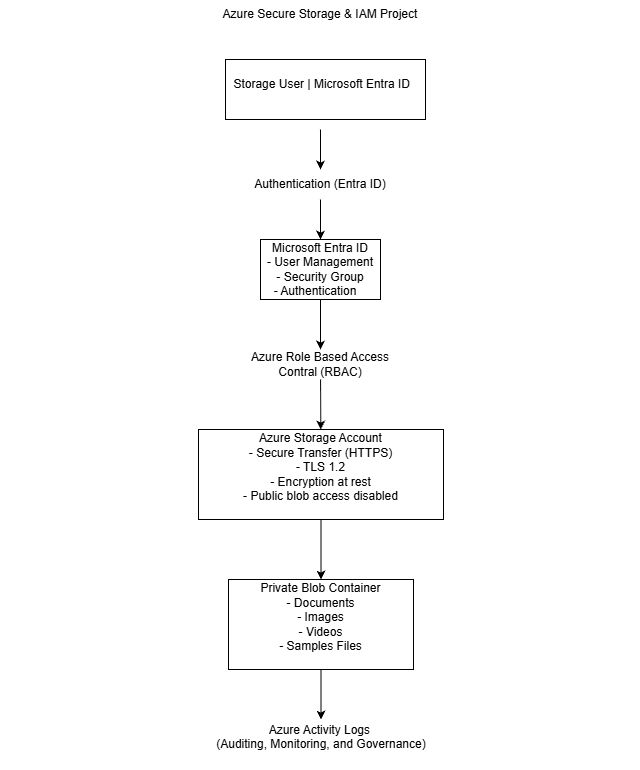

# Azure Secure Storage Project

# Project Overview

This project demonstrates the implementation of a secure cloud storage solution in Microsoft Azure using Microsoft Entra ID, Azure Role-Based Access Control (RBAC), and Azure Storage security best practices.

The objective was to simulate a real-world business environment in which organizational data is protected through identity-based authentication, least privilege authorization, secure storage configuration, and continuous monitoring.

Rather than focusing solely on infrastructure deployment, this project emphasizes governance, security, and identity management principles commonly used by cloud administrators, IAM engineers, and Governance, Risk, and Compliance (GRC) professionals.

---

# Business Scenario

A fictional organization requires a secure cloud repository for storing sensitive business documents.

Project requirements included:

* Secure storage of organizational files
* Identity-based authentication
* Group-based authorization
* Principle of Least Privilege
* Secure communication
* Administrative auditing
* Centralized access management

---

# Architecture



---

# Security Controls Implemented

* Microsoft Entra ID Authentication
* Azure Role-Based Access Control (RBAC)
* Security Groups
* Principle of Least Privilege
* Azure Blob Storage
* Private Blob Container
* HTTPS Only (Secure Transfer)
* TLS 1.2 Enforcement
* Anonymous Blob Access Disabled
* Encryption at Rest
* Azure Activity Logs
* Identity-Based Authorization

---

# Technologies Used

* Microsoft Azure
* Microsoft Entra ID
* Azure Storage Account
* Azure Blob Storage
* Azure RBAC
* Azure Activity Logs

---

# Project Structure

```text
azure-secure-storage-project/

README.md

documentation/
├── 01-resource-group.md
├── 02-storage-account.md
├── 03-blob-container.md
├── 04-entra-id-user.md
├── 05-security-group.md
├── 06-azure-rbac.md
├── 07-activity-log.md
├── 08-storage-security-review.md
└── 09-architecture-overview.md

screenshots/
├── 01-resource-group-created.png
├── 02-storage-account-created.png
├── 03-container-created.png
├── 04-file-uploaded.png
├── 05-entra-user-created.png
├── 06-security-group-created.png
├── 07-group-members.png
├── 08-role-assignments.png
├── 09-activity-log.png
├── 10-storage-security-settings.png
└── architecture-diagram.png
```

---

# Project Workflow

1. Created an Azure Resource Group.
2. Deployed a secure Azure Storage Account.
3. Created a private Azure Blob Container.
4. Uploaded sample organizational files.
5. Created Microsoft Entra ID user accounts.
6. Created Microsoft Entra ID Security Groups.
7. Implemented Azure Role-Based Access Control (RBAC).
8. Verified Azure Activity Logs.
9. Reviewed Storage Account security configuration.
10. Documented the complete implementation.

---

# Skills Demonstrated

### Microsoft Azure

* Azure Resource Groups
* Azure Storage
* Azure Blob Storage
* Azure Activity Logs

### Identity & Access Management

* Microsoft Entra ID
* User Provisioning
* Security Groups
* Azure RBAC
* Least Privilege

### Cloud Security

* Identity-Based Authentication
* Authorization
* Encryption
* Secure Transfer
* Cloud Governance

### Governance, Risk & Compliance (GRC)

* Security Documentation
* Configuration Reviews
* Identity Governance
* Access Management
* Security Best Practices

---

# Lessons Learned

During this project I strengthened my understanding of Azure resource management, Microsoft Entra ID, identity governance, Azure RBAC, cloud storage security, and governance documentation.

The project also reinforced the importance of designing cloud environments using identity-first security principles instead of relying on shared credentials or excessive administrative permissions.

---

# Future Improvements

Future enhancements could include:

* Azure Key Vault integration
* Private Endpoints
* Conditional Access Policies
* Multi-Factor Authentication (MFA)
* Microsoft Defender for Cloud
* Microsoft Sentinel integration
* Azure Backup
* Lifecycle Management Policies
* Azure Policy
* Microsoft Purview

---

# Documentation

Detailed implementation documentation is available in the **docs** directory.

Each phase includes:

* Objectives
* Configuration
* Security Considerations
* Business Justification
* Screenshots
* Key Takeaways

---

# Author

**Jacob Bryer**

Cybersecurity | Governance, Risk & Compliance (GRC) | Identity & Access Management (IAM)

Current certifications include:

* ISC2 Certified in Cybersecurity (CC)
* CompTIA Security+
* Microsoft Certified: Security, Compliance, and Identity Fundamentals (SC-900)

---

*This project was created for educational and professional portfolio purposes to demonstrate practical Microsoft Azure cloud security and identity management skills.*
