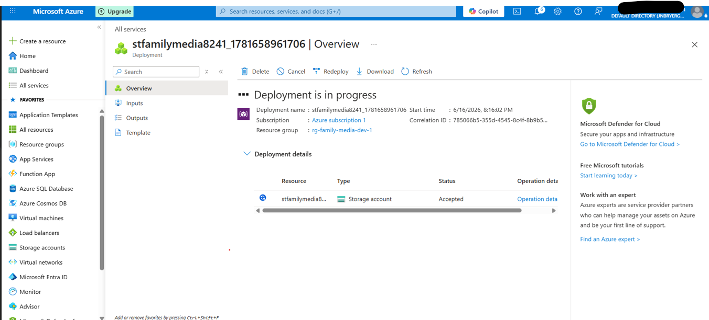

# Step 1 – Create an Azure Resource Group

## Objective

The first step in the project was creating a dedicated Azure Resource Group to organize and manage all cloud resources used throughout the deployment. Resource Groups provide a logical container for related Azure resources, simplifying administration, security, monitoring, and lifecycle management.

---

## Configuration

| Setting        | Value                 |
| -------------- | --------------------- |
| Subscription   | Azure Subscription 1  |
| Resource Group | `rg-family-media-dev` |
| Region         | East US               |

---

## Implementation

A new Resource Group named **rg-family-media-dev** was created in the **East US** region. All Azure resources created during this project will reside within this Resource Group, allowing centralized management and consistent security controls.

---

## Security Considerations

Using a dedicated Resource Group provides several security and governance benefits:

* Centralizes management of related cloud resources.
* Allows Azure Role-Based Access Control (RBAC) to be assigned at the Resource Group level.
* Simplifies auditing and monitoring activities.
* Supports resource lifecycle management by allowing all project resources to be managed or removed together.
* Helps separate development resources from production environments.

---

## Screenshot

---

## Skills Demonstrated

* Microsoft Azure
* Azure Resource Groups
* Cloud Resource Management
* Governance
* Identity and Access Management (IAM)
* Azure RBAC
* Cloud Security Best Practices

---

## Key Takeaway

Creating a dedicated Resource Group establishes a secure organizational boundary for cloud resources and provides a foundation for applying governance, security, and access control throughout the Azure environment.
