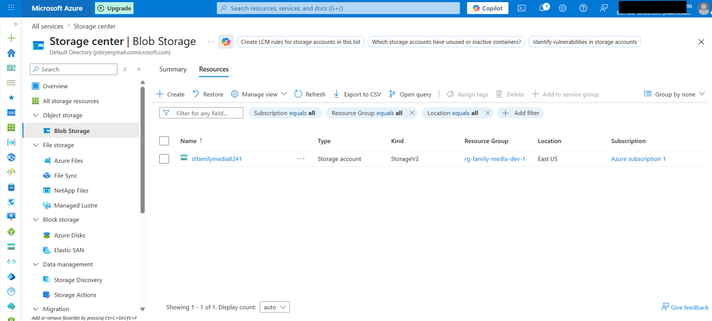
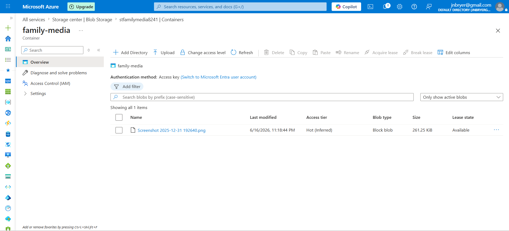

# Step 3 – Create a Private Azure Blob Container

## Objective

The next phase of the project involved creating a private Azure Blob Container within the Storage Account. Blob Containers organize stored files and provide an additional layer of access control. This container was configured to prohibit anonymous access, ensuring that only authenticated users with appropriate permissions can access stored data.

---

## Background

Azure Blob Storage is commonly used to store documents, backups, application assets, images, videos, and other unstructured data. Since these files often contain sensitive information, organizations should restrict access by default and require authentication through Microsoft Entra ID and Azure Role-Based Access Control (RBAC).

Following the principle of least privilege, all data should remain private unless a specific business requirement justifies broader access.

---

## Configuration

| Setting          | Value                             |
| ---------------- | --------------------------------- |
| Storage Account  | `stfamilymedia8241`               |
| Container Name   | `family-media`                    |
| Anonymous Access | **Private (No anonymous access)** |

---

## Implementation

A new Blob Container named **family-media** was created within the Azure Storage Account. During creation, the container was configured with **Private (no anonymous access)** permissions to ensure that files stored within the container cannot be accessed publicly over the internet.

A sample file was then uploaded to verify successful operation of the container and to prepare for future identity-based access testing.

---

## Security Considerations

Several cloud security best practices were implemented during this phase:

* Anonymous public access was disabled.
* Access will be managed using Microsoft Entra ID identities.
* Authorization will be enforced through Azure Role-Based Access Control (RBAC).
* The configuration supports the principle of least privilege by denying access unless explicitly granted.
* Private containers reduce the risk of accidental data exposure or unauthorized disclosure.

---

## Business Justification

Organizations frequently store confidential business information in Azure Blob Storage, including contracts, financial records, customer documents, backups, and application files. Restricting container access protects sensitive information while allowing administrators to centrally manage permissions through Azure identity services.

---

## Screenshot

The following screenshot confirms that the Blob Container was successfully created with anonymous access disabled.

*Figure 3. Azure Blob Container configured with private access, preventing anonymous access to stored files.*

---

## Screenshot

The following screenshot demonstrates a successful file upload to the private Blob Container.

*Figure 4. Sample file successfully uploaded to the private Blob Container for testing and validation.*

---

## Skills Demonstrated

* Microsoft Azure
* Azure Blob Storage
* Secure Cloud Storage
* Data Protection
* Identity and Access Management (IAM)
* Principle of Least Privilege
* Microsoft Entra ID
* Azure RBAC
* Cloud Governance

---

## Key Takeaways

Creating a private Blob Container ensures that organizational data remains protected from unauthorized access. By disabling anonymous access and preparing the environment for identity-based authorization, this implementation aligns with cloud security best practices and establishes a secure foundation for future RBAC configuration.
