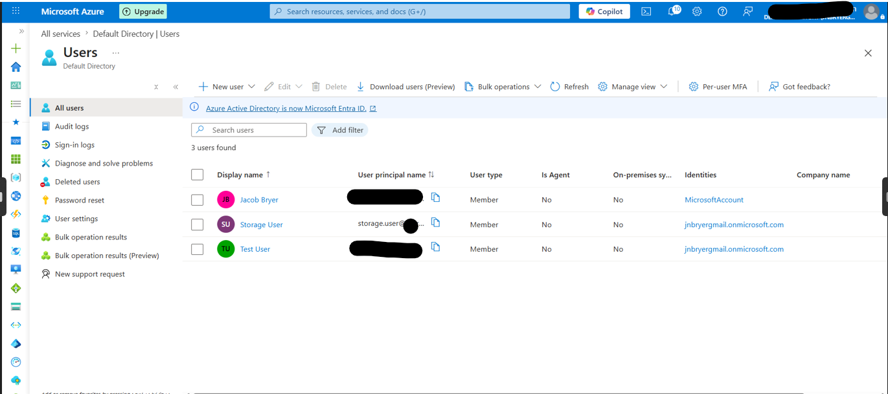

# Step 4 – Create a Microsoft Entra ID User

## Objective

This phase of the project focused on implementing identity management by creating a Microsoft Entra ID user account. The user represents an employee who requires authorized access to Azure resources. Identity-based authentication is a fundamental security control that replaces shared credentials with individual user accounts, improving accountability and governance.

---

## Background

Microsoft Entra ID provides centralized identity and access management for Azure resources. Rather than granting access through shared passwords or storage account keys, organizations authenticate users through Entra ID and authorize access using Azure Role-Based Access Control (RBAC).

This approach improves security by ensuring each individual has a unique identity that can be audited, managed, and revoked when necessary.

---

## Configuration

| Setting                  | Value                                   |
| ------------------------ | --------------------------------------- |
| Identity Provider        | Microsoft Entra ID                      |
| Display Name             | `Storage User`                          |
| User Principal Name      | `storage.user@<tenant>.onmicrosoft.com` |
| Authentication           | Password Authentication                 |
| Password                 | Automatically Generated                 |
| Password Change Required | Yes                                     |

---

## Implementation

A new Microsoft Entra ID user was created to simulate an employee requiring access to organizational cloud resources. This account will later receive permissions through Azure RBAC rather than using shared credentials or storage account access keys.

Using identity-based authorization supports stronger security controls and aligns with Zero Trust security principles.

---

## Security Considerations

The following identity management best practices were implemented:

* Each user receives a unique identity.
* Passwords are system-generated to improve security.
* Password changes are required at first sign-in.
* Access will be granted through Azure RBAC rather than shared secrets.
* Individual accounts provide full auditability for authentication and authorization events.

---

## Business Justification

Managing user identities through Microsoft Entra ID enables organizations to efficiently onboard and offboard employees, enforce authentication policies, integrate Multi-Factor Authentication (MFA), and maintain centralized control over access to cloud resources.

---

## Screenshot

The following screenshot confirms the successful creation of the Microsoft Entra ID user.

*Figure 5. Microsoft Entra ID user account created to support identity-based access management.*

---

## Skills Demonstrated

* Microsoft Entra ID
* Identity and Access Management (IAM)
* User Provisioning
* Identity Governance
* Azure Administration
* Zero Trust Security
* Cloud Identity Management

---

## Key Takeaways

Creating individual identities within Microsoft Entra ID provides the foundation for secure authentication, centralized identity management, and role-based authorization. This approach eliminates shared credentials and strengthens organizational security by ensuring that access decisions are tied to unique user identities.
