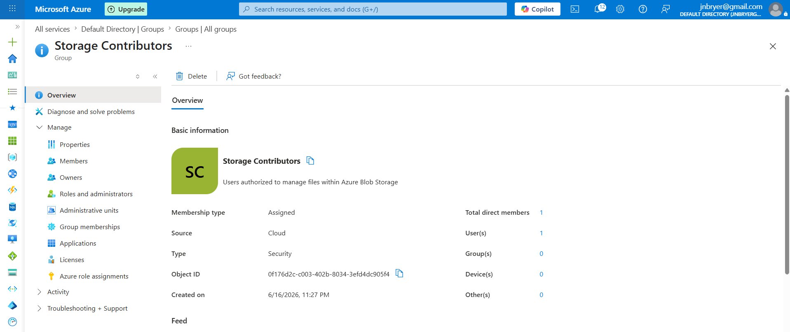
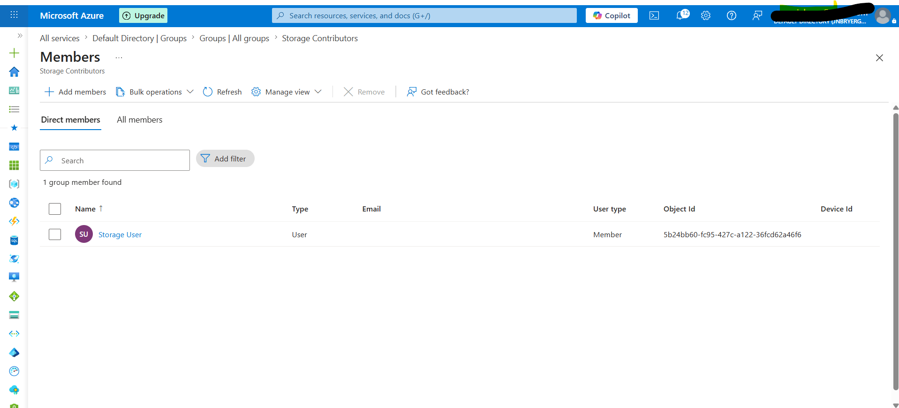

# Step 5 – Create a Microsoft Entra ID Security Group

## Objective

To simplify access management and follow identity governance best practices, a Microsoft Entra ID Security Group was created. Rather than assigning permissions directly to individual users, access will be managed through group membership. This approach improves scalability, consistency, and security across the Azure environment.

---

## Background

Microsoft Entra ID Security Groups allow administrators to organize users based on job responsibilities or business functions. Azure Role-Based Access Control (RBAC) permissions can then be assigned to the group instead of each individual user.

This approach significantly reduces administrative effort while supporting the principle of least privilege.

---

## Configuration

| Setting         | Value                  |
| --------------- | ---------------------- |
| Group Type      | Security               |
| Group Name      | `Storage Contributors` |
| Membership Type | Assigned               |
| Initial Member  | Storage User           |

---

## Implementation

A Security Group named **Storage Contributors** was created within Microsoft Entra ID.

The previously created **Storage User** account was added to the group. Future Azure permissions will be assigned to this Security Group rather than directly to the user account, following enterprise identity management best practices.

---

## Security Considerations

Using Security Groups provides several security advantages:

* Centralized permission management.
* Reduced risk of inconsistent user permissions.
* Easier onboarding and offboarding of employees.
* Supports the principle of least privilege.
* Improves auditability by managing permissions at the group level.

---

## Business Justification

Organizations frequently manage hundreds or thousands of users. Assigning permissions to Security Groups rather than individual accounts reduces administrative overhead, minimizes configuration errors, and ensures consistent access policies across departments.

---

## Screenshot

The following screenshot confirms the successful creation of the Microsoft Entra ID Security Group.

*Figure 6. Microsoft Entra ID Security Group created for centralized permission management.*

---

## Screenshot

The following screenshot shows the Storage User added as a member of the Security Group.

*Figure 7. Storage User successfully added to the Storage Contributors Security Group.*

---

## Skills Demonstrated

* Microsoft Entra ID
* Security Groups
* Identity Governance
* User Provisioning
* Group-Based Access Management
* Identity and Access Management (IAM)
* Azure Administration
* Least Privilege

---

## Key Takeaways

Managing permissions through Security Groups is a core IAM best practice. Group-based authorization improves scalability, simplifies administration, and reduces the likelihood of excessive or inconsistent user permissions across cloud environments.
