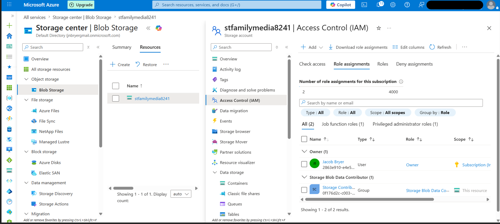

# Step 6 – Implement Azure Role-Based Access Control (RBAC)

## Objective

This phase of the project implemented Azure Role-Based Access Control (RBAC) by assigning a built-in Azure role to a Microsoft Entra ID Security Group. Rather than granting broad administrative permissions, the **Storage Blob Data Contributor** role was assigned to provide only the access required to manage files within Azure Blob Storage.

---

## Background

Azure RBAC enables organizations to control access to cloud resources using predefined roles. Permissions are assigned to users, groups, or service principals based on job responsibilities. This model supports the principle of least privilege by ensuring identities receive only the permissions necessary to perform their assigned tasks.

In enterprise environments, RBAC is a foundational component of cloud governance and identity management.

---

## Configuration

| Setting        | Value                           |
| -------------- | ------------------------------- |
| Azure Resource | Azure Storage Account           |
| Security Group | `Storage Contributors`          |
| Assigned Role  | `Storage Blob Data Contributor` |
| Scope          | Storage Account                 |

---

## Implementation

The **Storage Blob Data Contributor** role was assigned to the **Storage Contributors** Microsoft Entra ID Security Group through Azure Access Control (IAM).

Assigning permissions to the Security Group rather than directly to individual users simplifies administration and ensures future users automatically inherit the appropriate permissions through group membership.

---

## Security Considerations

The following identity and access management best practices were implemented:

* Permissions assigned to a Security Group instead of individual users.
* Principle of least privilege enforced through a narrowly scoped Azure role.
* Administrative privileges were intentionally avoided.
* Authorization is managed through Microsoft Entra ID identities.
* Access decisions are fully auditable through Azure Activity Logs.

---

## Business Justification

Organizations frequently manage hundreds or thousands of users. Assigning Azure permissions to Security Groups allows administrators to onboard new employees quickly while maintaining consistent access policies and reducing administrative overhead.

This approach also minimizes the risk of privilege creep and unauthorized access by ensuring permissions remain centrally managed.

---

## Screenshot

The following screenshot verifies that the assigned role appears within the Azure IAM role assignments for the Storage Account.

*Figure 10. Verification of Azure RBAC role assignment within Access Control (IAM).*

---

## Skills Demonstrated

* Azure Role-Based Access Control (RBAC)
* Microsoft Entra ID
* Identity and Access Management (IAM)
* Principle of Least Privilege
* Azure Storage
* Cloud Governance
* Azure Access Control (IAM)
* Cloud Security Administration

---

## Key Takeaways

Implementing Azure RBAC provides secure, scalable, and auditable authorization for cloud resources. Assigning permissions through Security Groups rather than directly to users aligns with enterprise IAM best practices, strengthens governance, and reduces the risk of excessive privileges.
