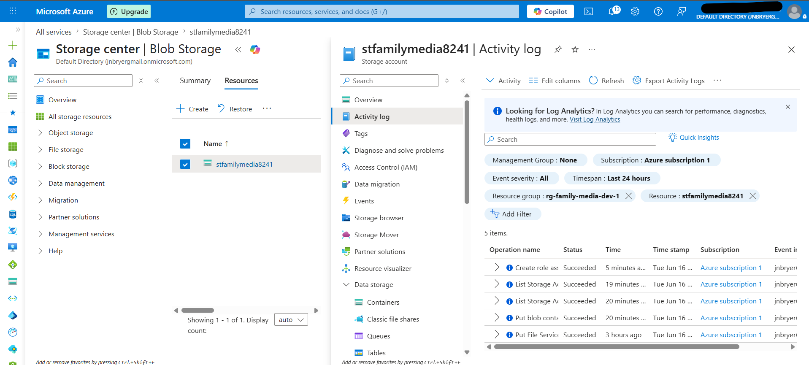

# Step 7 – Monitor Azure Activity Logs

## Objective

The objective of this phase was to review Azure Activity Logs to verify administrative actions performed during the deployment of the Azure Secure Storage & IAM Project. Activity Logs provide a centralized audit trail of management operations, enabling organizations to monitor changes, investigate incidents, and support compliance requirements.

---

## Background

Azure Activity Logs record management-plane events across Azure resources, including resource creation, configuration changes, role assignments, and administrative actions. These logs help security teams detect unauthorized changes, investigate incidents, and demonstrate compliance with organizational policies and regulatory requirements.

Maintaining an audit trail is a critical component of cloud governance and security operations.

---

## Configuration

| Setting         | Value                                       |
| --------------- | ------------------------------------------- |
| Resource        | Azure Storage Account                       |
| Log Type        | Azure Activity Log                          |
| Time Range      | Last 24 Hours                               |
| Events Reviewed | Resource creation and configuration changes |

---

## Implementation

The Azure Activity Log was reviewed after completing the deployment tasks. The log confirmed that resource creation, configuration updates, and RBAC assignments were successfully recorded with timestamps and operation status.

This verification demonstrates that Azure automatically maintains an auditable record of administrative activities performed within the subscription.

---

## Security Considerations

Reviewing Azure Activity Logs provides several security benefits:

* Maintains an auditable record of administrative actions.
* Supports incident response and forensic investigations.
* Enables verification of configuration changes.
* Assists with regulatory compliance and governance requirements.
* Improves visibility into cloud resource management activities.

---

## Business Justification

Organizations require reliable audit logs to investigate security incidents, validate administrative actions, and demonstrate compliance during internal or external audits. Azure Activity Logs provide centralized visibility into management activities and support effective cloud governance.

---

## Screenshot

The following screenshot shows Azure Activity Log entries generated during the deployment of this project.

*Figure 7. Azure Activity Log displaying successful management operations performed during project deployment.*

---

## Skills Demonstrated

* Azure Activity Logs
* Cloud Monitoring
* Security Auditing
* Governance
* Compliance
* Incident Investigation
* Cloud Administration
* Microsoft Azure

---

## Key Takeaways

Azure Activity Logs provide an essential audit trail for cloud environments by recording administrative actions and configuration changes. Reviewing these logs improves operational visibility, supports incident response, and strengthens governance through continuous monitoring of Azure resources.
