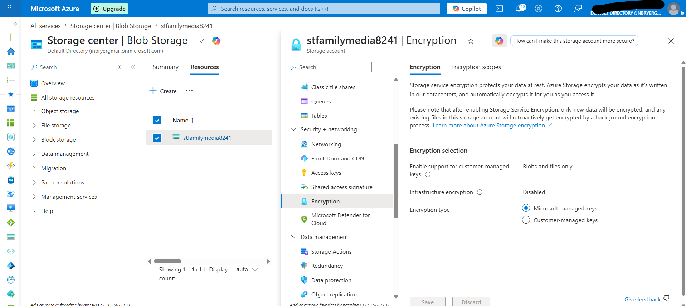

# Step 8 – Review Azure Storage Security Configuration

## Objective

The final technical phase of the project involved reviewing the security configuration of the Azure Storage Account to verify that recommended security controls were enabled. This assessment demonstrates how cloud administrators and GRC professionals evaluate Azure resources against security best practices.

---

## Background

Misconfigured cloud storage is one of the leading causes of unintended data exposure. Azure provides several built-in security controls that help protect data during transmission, restrict anonymous access, and encrypt information at rest. Verifying these settings is an important part of cloud governance and security assessments.

---

## Configuration Review

| Security Control         | Configuration                     |
| ------------------------ | --------------------------------- |
| Secure Transfer Required | Enabled                           |
| Minimum TLS Version      | TLS 1.2                           |
| Anonymous Blob Access    | Disabled                          |
| Encryption               | Enabled (Microsoft-managed keys)  |
| Authentication           | Microsoft Entra ID and Azure RBAC |

---

## Implementation

The Azure Storage Account configuration was reviewed to confirm that recommended security settings were in place. Secure transfer was enforced, modern TLS encryption was required, anonymous blob access remained disabled, and Azure encryption protected stored data.

These settings help reduce the risk of unauthorized access while supporting secure communication between clients and Azure services.

---

## Security Considerations

The following security controls were verified:

* HTTPS-only communication enforced through Secure Transfer.
* TLS 1.2 required for encrypted network communication.
* Anonymous access to Blob Storage disabled.
* Data encrypted at rest using Azure-managed encryption keys.
* Identity-based authorization managed through Microsoft Entra ID and Azure RBAC.

---

## Business Justification

Reviewing cloud security settings is a routine responsibility for security, governance, and compliance teams. Verifying configuration against best practices helps reduce security risks, supports regulatory compliance, and ensures sensitive organizational data is appropriately protected.

---

## Screenshot

The following screenshot shows the Azure Storage Account encryption settings reviewed during this assessment.

*Figure 8. Azure Storage Account configured with microsoft-managed keys.*

---

## Skills Demonstrated

* Azure Storage Security
* Cloud Security Assessment
* Security Configuration Review
* Microsoft Entra ID
* Azure RBAC
* Governance, Risk, and Compliance (GRC)
* Cloud Governance
* Security Best Practices

---

## Key Takeaways

Reviewing and validating cloud security configurations is a critical component of governance and risk management. Verifying secure transfer, encryption, modern TLS protocols, and restricted anonymous access helps ensure Azure resources are deployed according to recognized cloud security best practices.
